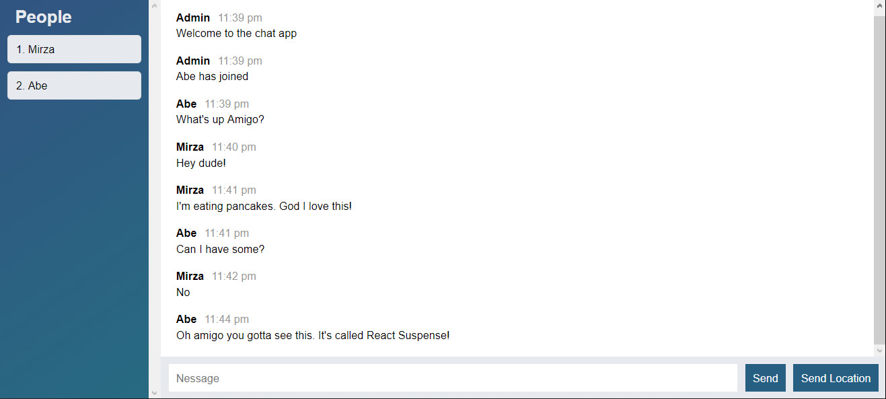

### Chat 4pp

I love learning new technologies and for my latest project I choose to learn web sockets. As I was learning, I created this
simple chat app. **Chat 4pp** allows users to create their own rooms, join other rooms and enjoy private chat.


#### *Tech stack*:

App is built Javascript alone. No third-party libraries, no frontend frameworks. 
I used NodeJS on backend and webpack for module bundling on client side. You can see a full list of tehnologies below:

``` bash
# Frontend:
- HTML                  - CSS                  - Sass  
- Javascript           - EcmaScript6+
# Backend: 
- NodeJS                - ExpressJS            - Web Sockets
# Build tools:         
- Webpack 4    
# Unit testing:           
- Mocha                 - Expect   
``` 


Feel free it experience app in first hand. Once app is polished it will be available on Heroku for everyone to use.
